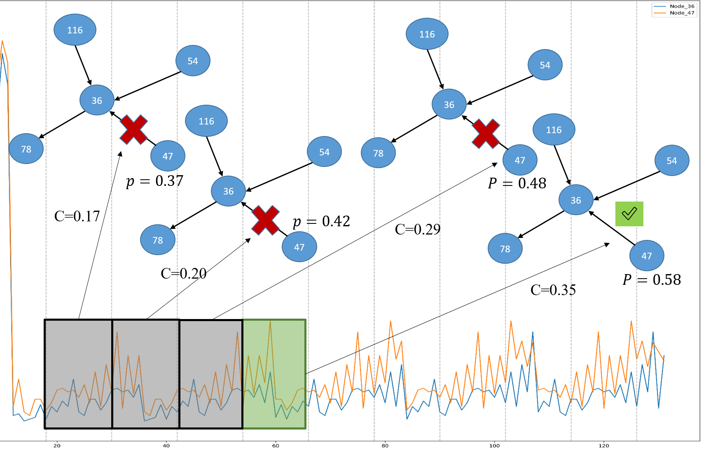

# GINTRIP: Interpretable Temporal Graph Regression using Information Bottleneck and Prototype-based Method

This repository contains the official implementation of [**GINTRIP: Interpretable Temporal Graph Regression using Information Bottleneck and Prototype-based Method**](https://arxiv.org/abs/2409.10996v1), as presented at ICASSP 2025.

## Overview

Deep neural networks (DNNs) have achieved remarkable performance across various domains, yet applying them to temporal graph regression tasks presents significant challenges regarding interpretability. The complexity of both DNNs and the underlying spatio-temporal patterns in graphs necessitates innovative solutions. Although interpretability concerns in Graph Neural Networks (GNNs) parallel those of DNNs, to the best of our knowledge, no significant work has addressed the interpretability of temporal GNNs using a combination of Information Bottleneck (IB) principles and prototype-based methods.

GINTRIP leverages these principles to provide an interpretable framework for temporal graph regression, allowing for more insightful analysis of spatio-temporal data.


## Requirements

To run GINTRIP, the following Python packages are required:

```
- torch >= 2.1.0
- torch-geometric == 2.0.4
- torch-scatter == 2.0.9
- torch-sparse == 0.6.13
```

## Results




## Datasets

We used the PeMS04, PeMS07, and PeMS08 datasets for the experiments. These datasets are available at the following link: [Link to Dataset](https://vub-my.sharepoint.com/:u:/g/personal/seyed_mohamad_moghadas_vub_be/EYCkNe_FhbNNngbW2V9rbvkBx2XR25wJxydyCmq_EU3nPA?e=axhsx9).

## Model Checkpoint

The model checkpoint is available here: [Link to Model Checkpoint](https://vub-my.sharepoint.com/:u:/g/personal/seyed_mohamad_moghadas_vub_be/EYTDdg507DNCg-pLWbjG3EEBeUo3FPZEI11TNIcr3Qvf4A?e=koIqqF).

## Running the Code

### Training the Model

To train GINTRIP from scratch, run the following command:

```bash
python -m trainer
```

To train on specific datasets:

**PeMS04**

```bash
python trainer.py --gcn_true true --data datasets/PEMS04 --num_nodes 307 --adj_data /<PATH>/PEMS04/PEMS04.csv --in_dim 1 --epochs 500 --mi_loss true
```

**PeMS07**

```bash
python trainer.py --device cuda:1 --num_nodes 883 --adj_data /<PATH>/PEMS07.csv --data /<PATH>/PEMS07.npz
```

**PeMS08**

```bash
python trainer.py --device cuda:1 --num_nodes 170 --adj_data /<PATH>/PEMS08.csv --data /<PATH>/PEMS08.npz
```

### Inference

To perform inference using a trained model, run the following command:

```bash
python trainer.py --inference ./save/exp1_c1ef0be6-4a20-4fc0-8bcf-b68e42adc990.pth --layers 9 --F_S None
```

### Visualization

To visualize the results:

**Figure 2**

```bash
python trainer.py --inference ./save/exp1_c1ef0be6-4a20-4fc0-8bcf-b68e42adc990.pth --visualize True --layers 9 --F_S None
```

**Figure 3**

```bash
python results/benchmark.py
```

## Crime dataset(Nov. update)

## Argparser Parameter Descriptions

The following are descriptions of the parameters used in the argument parser (argparser):

- `--gcn_true`: Boolean flag indicating whether to use GCN (Graph Convolutional Network).
- `--data`: Path to the dataset directory.
- `--num_nodes`: Number of nodes in the graph.
- `--adj_data`: Path to the adjacency data file.
- `--in_dim`: Input dimension of the data.
- `--epochs`: Number of training epochs.
- `--mi_loss`: Boolean flag to use mutual information loss for the regression.
- `--device`: Device to use for training/inference (e.g., `cuda:0` for GPU).
- `--inference`: Path to the trained model checkpoint for inference.
- `--layers`: Number of layers in the model.
- `--F_S`: Feature selection parameter (optional).
- `--visualize`: Boolean flag to enable visualization of results.
- `--num_split`: Number of to split subgraphs

## Citation

If you use this code or find our work helpful, please consider citing us:

```bibtex
@misc{royat2024gintripinterpretabletemporalgraph,
  title={GINTRIP: Interpretable Temporal Graph Regression using Information Bottleneck and Prototype-based Method},
  author={Ali Royat and Seyed Mohamad Moghadas and Lesley De Cruz and Adrian Munteanu},
  year={2024},
  eprint={2409.10996},
  archivePrefix={arXiv},
  primaryClass={cs.LG},
  url={https://arxiv.org/abs/2409.10996}
}
```

## Acknowledgments

We gratefully acknowledge the following repository for its work:

[https://dl.acm.org/doi/10.1145/3583780.3614871](https://dl.acm.org/doi/10.1145/3583780.3614871)

## Contact

For questions or issues, feel free to reach out via email: [seyed.mohamad.moghadas@vub.be](mailto:seyed.mohamad.moghadas@vub.be)
